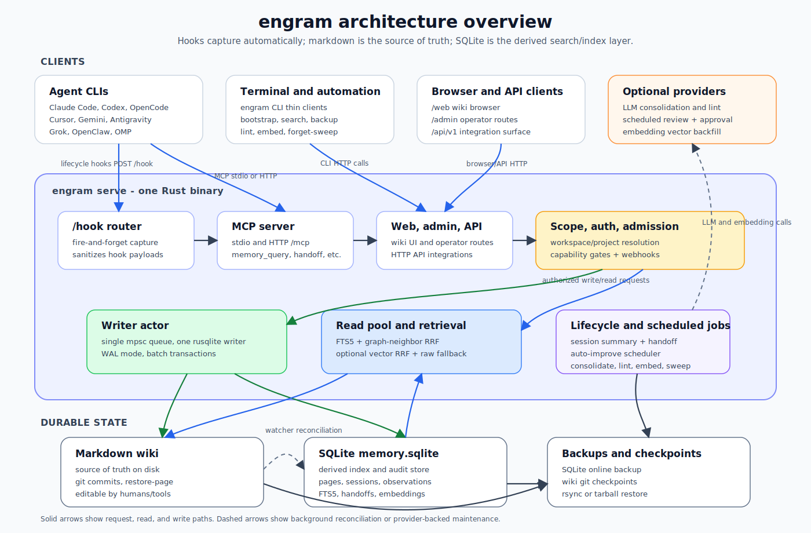

# engram - Architecture

> One canonical doc for "what is this thing and how is it shaped".
> Long-form research lives next to this file under [`docs/`](.); this
> page is the operational summary for someone reading the code.

## Purpose

engram is a single Rust binary that gives AI coding agents (Claude
Code, OpenAI Codex, Cursor, Gemini CLI, Antigravity CLI, Grok Build CLI,
OpenClaw, OpenCode, OMP, and MCP-capable clients) long-term memory shared across CLIs.
Quit one mid-task; open another in the same directory; continue. No
manual `write_note` ceremony, no copy-pasting summaries between
sessions.

The artifact you accrete is a **Karpathy-style LLM wiki**: a
git-versioned tree of markdown pages on disk that gets *compiled* over
time, appended-to. Pages are versioned in place via
supersession, semantic concepts compound, episodic logs decay. A
companion SQLite index gives FTS5 + optional vector retrieval; the
markdown stays the source of truth.

## Data flow



Solid arrows are request, read, and write paths. Dashed arrows are
background reconciliation or provider-backed maintenance. The core invariant is
unchanged: the markdown wiki is the source of truth, and SQLite is the derived
index for search, sessions, observations, handoffs, audit, and embeddings.
Auto-improvement sits on the provider-backed maintenance side: the server
schedules reviews for newly completed sessions in every project, records
validated proposals in the pending-writes audit trail, and auto-approves them
through the normal wiki write path by default. Scheduler ticks are
non-overlapping; long all-project review passes delay the next tick instead of
starting another copy. Scheduling and approval are separate. Admins can set
`[auto_improve.scheduler] enabled = false` to stop background review, or
`[auto_improve] require_approval = true` to leave scheduled and manual proposals
pending for review. Operators can additionally set `[auto_improve.eval]` to run
a project-supplied executable gate for selected proposal prefixes after LLM
validation and before staging/approval; it is disabled by default and never runs
from hook paths.

**Steady-state loop:**

1. Agent CLI emits a lifecycle hook (SessionStart, UserPromptSubmit,
   PostToolUse, …). Shell-script hooks `curl` event JSON to `POST /hook`
   with a short timeout. Native `engram hook --event ...` commands spool
   events locally, do a short bounded cleanup at session start, and hand
   session-end delivery to a detached lock-aware `hook-drain` helper;
   high-latency operators can raise the drain/handoff/background caps with
   minute-based env vars.
   Agent hot paths never block on the network; saturated servers return HTTP
   429 instead of queueing unbounded work.
2. Server's hook router sanitises the payload (the only path from
   untrusted text into the store), assigns an [`ObservationKind`], and
   enqueues a `WriteCmd` to the writer actor. `log.md` gets an
   appended `## [YYYY-MM-DDTHH:MM:SSZ] <event> | <title>` line.
3. On true `SessionEnd` events, the server synthesises a
   `sessions/<id>.md` summary page (rule-based, no LLM) and opens a
   `Handoff` row for the next agent. Auto-commits the wiki. Clients
   without a true session-end hook (currently Antigravity CLI) should call
   `memory_handoff_begin` before quitting when a handoff is needed.
4. When `ENGRAM_LLM_PROVIDER` is set, `memory_consolidate` rewrites
   that summary into a richer durable page or fans out into a
   multi-page batch under `concepts/`, `decisions/`, `gotchas/`.
5. When an LLM provider is configured, the auto-improvement scheduler reviews
   newly completed sessions across all projects outside hook latency. It records validated
   `concepts/`, `decisions/`, `gotchas/`, `procedures/`, and `_rules/` proposals
   in the pending-writes audit trail, then approves them through the wiki
   mutation path by default. The scheduler initializes a per-project first-run
   watermark so historical sessions are not processed automatically on upgrade,
   then records per-session claims before LLM work so failed scheduled reviews do
   not retry forever. Explicit CLI/admin/MCP auto-improve calls use the same
   pipeline for targeted reruns or catch-up. With `[auto_improve]
   require_approval = true`, scheduled and manual proposals remain pending until
   explicit pending-writes approval. If `[auto_improve.eval] enabled = true`,
   targeted proposals (default `_rules/` and `procedures/`) must pass the
   configured executable JSON contract before they are staged; failures become
   rejected candidates/rejection-buffer entries rather than wiki writes.
6. `memory_query` answers via FTS5 + link-neighbour RRF; when an
   embedder is configured, vector cosine over `page_embeddings` joins
   the same RRF. If compiled wiki pages miss entirely, bounded raw
   observation FTS returns fallback `raw_hits`. Page hits bump
   `access_count` + `last_accessed_at` - the M8 reinforcement term.
7. The forget sweep runs on demand and on the server's `[maintenance]`
   schedule: pages with `retention < cold_threshold` are soft-deleted;
   soft-deletions older than `hard_delete_after_days` with no subsequent
   access get purged. Semantic / pinned / freshly-touched pages survive.
8. Backups: `engram backup --to <tarball>` uses SQLite's online
   backup API so the source stays writable; `engram restore`
   reverses. Or: `git push` the wiki dir + `rsync` the data dir.

## Hook event vocabulary

The core observation vocabulary is a closed set of agent lifecycle
events. Hook bridges may accept client-specific aliases, but storage
normalises them to exactly one of these `ObservationKind` values:

| Stored kind | Semantics |
|---|---|
| `session-start` | Agent session began; cwd/model/session identity captured. |
| `user-prompt` | User submitted prompt text to the agent. |
| `pre-tool-use` | Agent is about to call a tool. |
| `post-tool-use` | Agent finished a tool call. |
| `pre-compact` | Agent is about to compact or compress its context. |
| `notification` | Agent emitted a notification-style event. |
| `stop` | Agent finished an interactive turn or stopped naturally. |
| `session-end` | Agent session ended; summary/handoff path may run. |
| `other` | Unknown or unsupported hook event. |

Unknown events do **not** expand the enum and, by default, leave no
source-event metadata in storage; they collapse to `other`. Third-party
integrations that need their own vocabulary can opt in by sending
`extension=<namespace>` on `/hook`. With a valid extension namespace,
engram stores an explicit `source_event=<name>` when provided, or the
unknown `event` string when `source_event` is omitted. The stored pair is
nullable observation metadata; `kind` stays canonical. This is an
extension seam, not a runtime plugin system: external processors must use
the existing HTTP/MCP APIs and cannot bypass the sanitizer, hook
backpressure, or single-writer SQLite actor.

## Storage architecture

**Two layers, one source of truth.**

* `<data_dir>/wiki/` - markdown source of truth. Owned by a `git2`
  repo so every consolidation pass + every session-end produces a
  durable commit. Editable by hand in Obsidian / vim - the watcher
  reconciles outside edits.
* `<data_dir>/db/memory.sqlite` - derived index. WAL mode. One
  writer actor owns the writer `Connection`; reads go through a
  cloneable read-only pool.
* `<data_dir>/raw/` - reserved for raw session log archives; current raw
  fallback recall searches the durable `observations` table via FTS5.
* `<data_dir>/logs/` - rolling daily `tracing` output.
* `<data_dir>/models/` - reserved for bundled embedding models
  (M9.5+, when local `ort` lands).

**Schema (current head):**

| Table | What |
|---|---|
| `workspaces`, `projects` | Top of the 3-tuple identity coordinate. |
| `pages` | Versioned wiki pages with `is_latest` + `supersedes` chain. M8 columns: `last_accessed_at`, `access_count`, `superseded_at`. M9 cols: `embedding_provider`, `embedding_model`, `embedding_dim`. |
| `pages_fts` | FTS5 virtual table over `(title, body)`, auto-synced by triggers. |
| `sessions`, `observations` | Hook capture, full audit log. |
| `observations_fts` | FTS5 virtual table over raw observation `(title, body)`, used only as bounded fallback. |
| `links` | Wikilink / markdown cross-references. `to_page_id` (a global PageId) is nullable for unresolved forward links. `to_workspace` / `to_project` carry a cross-project scope (NULL = the source page's own project). |
| `handoffs` | Typed cross-agent handoff records (open / accepted / expired). |
| `page_embeddings` | Optional vector rows for latest pages, one row per document chunk (`(page_id, chunk_index)` PK; long pages split on markdown boundaries, short pages are a single chunk 0). `(provider, model, dim)` is denormalised so hybrid search can ignore stale vectors after an embedding config change and report missing-embedding diagnostics. The vector leg max-pools chunk scores per page. |
| `audit_log` | Every mutation, addressable by `at DESC`. |

**Memory tiers (M8 policy):**

| Tier | Lifetime | Decay |
|---|---|---|
| Working | Current session only | Hard-drop on session end (kept in `observations` for forensics) |
| Episodic | 30d hot → 180d cold → evict | `salience · exp(−λΔt) + σ · log(1+access_count) · exp(−μ · days_since_access)` |
| Semantic | Indefinite | None - only supersedeable via M7 LLM rewrite |
| Procedural | Indefinite | Frequency-decay if not re-observed |

Pinned pages (`pinned: true` in frontmatter) are exempt from all
decay paths. Pages under `_slots/` are pinned automatically and surfaced
in briefing/explore snapshots as tiny editable memory slots. Slot pages
may declare a write regime with `slot_kind: state` or
`slot_kind: invariant`; omitted means `state` for backwards
compatibility. Use `state` for mutable working context such as current
focus and pending items. Use `invariant` for high-resistance project
context, identity, rules, or user preferences; consolidation should not
rewrite an existing invariant slot unless new observations directly
contradict specific existing content.

## Cross-project links

Pages normally link within their own project (`[[decisions/0001.md]]`,
`[label](../gotchas/x.md)`). A wikilink can also name another project so
that dependencies between projects become explicit edges in the graph:

* `[[project:path.md]]` — a sibling project in the same workspace.
* `[[workspace/project:path.md]]` — a project in another workspace.

The parser (`engram-wiki::extract_links`) yields a `LinkTarget
{ workspace, project, path }`; the store resolves it against the named
project's latest page and records the scope in `links.to_workspace` /
`links.to_project` (NULL = the source's own project, the common case).
Resolution is deferred-safe: a link to a page that does not exist yet
stays `to_page_id = NULL` and is repointed by
`refresh_incoming_links_for_path` when that page later lands — across
projects, not only within one.

Because `to_page_id` is a global id and `ReaderPool::page_links` joins by
id without a project filter, a resolved cross-project link surfaces as a
backlink on its target for free; `RelatedPage` carries the source's
`workspace` / `project` so the dependency is labelled and navigable. This
is what turns the per-project wikis into one dependency graph (see also
the `memory_lint` dangling-ref check, the briefing dependents counts, and
the `/api/v1/graph` endpoint).

## Crate layout

```
crates/
├── engram-core/        domain types, errors, ids. NO IO.
├── engram-store/       SQLite + writer actor + reader pool + decay math.
├── engram-wiki/        atomic markdown writes, file watcher, git.
├── engram-mcp/         rmcp transport + tool router.
├── engram-hooks/       payload schemas, sanitiser, /hook ingress.
├── engram-llm/         provider auth boundary + LlmProvider / Embedder traits.
├── engram-consolidate/ Karpathy ingest / lint / sweep / auto-improve pipeline.
└── engram-cli/         `engram` binary entry point + thin HTTP subcommands.
```

Each crate has a single responsibility and exposes a typed API. No
circular deps. Inter-crate boundaries enforce the cross-cutting
invariants below.

## MCP tool surface (16 tools)

| Tool | Hint | Purpose |
|---|---|---|
| `memory_query` | read-only | FTS5 + graph RRF + optional vector RRF search, with raw fallback. Bumps access counters for page hits. Defaults to the current project; `scopes` searches named sibling projects; `global=true` searches every project at once (each hit annotated with its workspace + project). |
| `memory_recent` | read-only | Most-recently-updated `is_latest=1` pages. |
| `memory_read_page` | read-only | Fetch the FULL body of a single wiki page by `path` or by top FTS5 hit for a `query`; optional `workspace` + `project` targets a named sibling workspace/project. Use when an agent needs more than the 24-word snippets from `memory_query`. |
| `memory_status` | read-only | Counts, paths, version. |
| `memory_briefing` | read-only | Structured counts/activity/rules/slots/recent snapshot. |
| `memory_explore` | read-only | LLM prose digest over the briefing snapshot, degrading to JSON without a provider. |
| `memory_handoff_begin` | destructive | Open a handoff for the next agent. Optional `workspace` + `project` targets a named sibling workspace/project. |
| `memory_handoff_accept` | destructive | Fetch + ack the latest open handoff (auto-cwd-matched by default). Optional `workspace` + `project` targets a named sibling workspace/project. |
| `memory_handoff_cancel` | destructive | Mark an exact open handoff id expired when it was created by mistake. |
| `memory_consolidate` | destructive | LLM-driven page rewrite. `multi_page=true` for atomic fan-out. |
| `memory_auto_improve` | write | Manually review a completed session and apply or stage validated wiki edits through the auto-improvement approval path. Defaults to the latest completed session in the resolved current project; the server also schedules review for new sessions; `[auto_improve] require_approval = true` leaves proposals pending for manual review. |
| `memory_write_page` | destructive | Write durable wiki knowledge when the user explicitly asks to remember/annotate something permanent. |
| `memory_delete_page` | destructive | Delete a single page by exact `path`. Fires the admission chain (op=delete); idempotent. |
| `memory_forget_sweep` | destructive | M8 retention pass. `dry_run=true` for preview. |
| `memory_lint` | destructive | Rule-based + LLM contradiction findings → `wiki/_lint/`. |
| `memory_install_self_routing` | read-only | Return the canonical slim routing snippet plus managed Agent Skill payloads and target hints for CLAUDE.md / AGENTS.md installs. |

`memory_briefing`, `memory_explore`, `memory_write_page`,
`memory_install_self_routing`, `memory_read_page`, `memory_delete_page`,
`memory_handoff_cancel`, and `memory_auto_improve`
post-date the original "narrow on purpose" cut (§10 of
`design-decisions.md`): briefing/explore separate the structured vs.
prose halves of "what's going on", `memory_write_page` covers explicit
durable annotations without abusing single-use handoffs,
`memory_install_self_routing` exists for the meta case where the agent
must re-write its own routing rules into a project's `CLAUDE.md` /
`AGENTS.md` and install the companion managed Agent Skills into
`.claude/skills` or `.agents/skills`, `memory_read_page` complements
`memory_query` for the "I need the full page, not a snippet" case
(e.g. opening a decision page end-to-end), `memory_auto_improve` exposes a
safe default-on learning review through the same approval/write path as
pending writes, and `memory_delete_page` is the exact-path destructive pair
needed by admission-aware mirrors. `memory_handoff_cancel` is the safety valve
for mistaken handoff creation. The narrow-surface discipline still holds —
every new tool has to earn its slot — but the v1 count is 16, not 10.

The managed Agent Skills are a narrow prompt-packaging exception to the
otherwise wiki-centered architecture. They are static `SKILL.md` files that
teach agents when to call engram MCP tools; they are not durable wiki pages,
not auto-improvement output, and not a runtime skill router inside engram.

MCP parameter aliases are intentionally sparse: `memory_query.query` accepts
`q|search`, and limit fields accept `n` / `top_k` where shipped. Project and
cwd parameters use their canonical names.

## CLI subcommand surface

```
init                 status               search
read-page            write-page           delete-page
serve                reset                backup
restore              reindex              install-hooks
hook                 install-mcp          commit
checkpoints          restore-page         llm-test
forget-sweep         lint                 auto-improve
auto-improve-report  curator              pending-writes       embed
generate-auth-token  setup-agent          bootstrap
install-instructions install-skills        reorg
rename-project       move-project         audit-contamination
uninstall            auth                 user
```

Run `engram --help` for the full tree.

`auto-improve-report` is read-only by default; `--stage` creates one pending
telemetry report page for audit/approval without staging learning-memory edits.

## Cross-cutting invariants

Carved in M0/M1; every milestone has to respect them. Each comes from
a documented prior-art bug; cite the source when reviewing changes
that touch the relevant area.

1. **One config-read path.** `Config::load()` called once at startup.
   No `std::env::var` outside it.  (agentmemory #456 / #469.)
2. **Single-writer SQLite actor.** All writes go through one `mpsc`
   channel to one dedicated OS thread. (cognee #2717.)
3. **Indexes commit in the same transaction as the data.** No
   background-task-indexing-after-return. (basic-memory #763 / #578.)
4. **Typed 3-tuple identity** (`workspace_id`, `project_id`, path)
   in every domain row from day one. (basic-memory #783 / #834.)
5. **Hooks are fire-and-forget.** Hook scripts hard-timeout at
   ≤200 ms; server returns 202 immediately or 429 when saturated.
   (agentmemory #221 / #143.)
6. **Privacy strip is a typed boundary.** `Sanitized<NewObservation>`
   has no other constructor than `sanitize()`. (design-decisions §14.)
7. **JSON-schema structured outputs only.** Native provider JSON
   modes; no XML, no Instructor wrapping. (agentmemory #492 / #539,
   cognee #2840.)
8. **`{provider, model, dim}` denormalised next to every embedding.**
   Warn and ignore stale vectors on mismatch until re-embedding completes.
   (agentmemory #469.)
9. **Live-process check before destructive ops.** `engram reset`,
   `backup`, `restore` all consult `sysinfo`. (basic-memory #765.)
10. **Atomic file writes** (tmp + rename + fsync). Watcher ignores
    own writes by filename prefix.
11. **Absolute canonical data dir** default; logged loudly on
    startup. (agentmemory #303.)
12. **No global singletons / `lazy_static` configs.** All deps
    explicit. (cognee #2228.)
13. **Zero-LLM default path.** LLM has opt-in via env. The
    system works without any provider configured.
14. **Provider auth resolves before provider construction.** Native
    provider clients consume typed `ProviderAuth` material; they never
    read env vars directly. Token-backed providers receive explicit
    auth-file paths / env-derived token material through that boundary,
    then own provider-specific refresh and persistence.
15. **Tracing subscribers explicitly filter their own module.**
    No feedback loops. (agentmemory #519.)

## Configuration (`config.toml`)

Lives at `<data_dir>/config.toml`. All values overridable by env vars
prefixed `ENGRAM_*`.

```toml
bind = "127.0.0.1:49374"
log_level = "info"

[decay]                            # M8 retention params
lambda = 0.02                      # ↓ to forget less aggressively
sigma = 0.6                        # ↑ to reward query-hits more
mu = 0.04                          # ↑ if recent hits should count more
cold_threshold = 0.20              # below this → soft-delete
hard_delete_after_days = 180

[auto_improve]                     # default-available learning reviewer
require_approval = false           # true leaves proposals pending for review
min_observations = 8
min_session_duration_secs = 120
min_confidence = 0.75
max_input_tokens = 24000
max_proposals_per_run = 5
max_patchable_pages = 8
max_patchable_body_chars = 8000
max_edits_per_proposal = 5
max_edit_content_chars = 4000
max_changed_chars_per_proposal = 12000
max_patch_edits_per_run = 8
max_rejection_context = 50
rejection_context_days = 180
max_final_body_chars = 32000
max_rule_page_tokens = 2000
max_procedure_page_tokens = 2000
include_raw_fallback = false
proposal_actor = "auto_improve"
pending_path = "_pending/auto-improve"

[auto_improve.scheduler]           # background review; separate from approval
enabled = true
interval_secs = 3600
max_sessions_per_tick = 1        # per project; scheduler ticks do not overlap
min_session_age_secs = 600
```

**LLM provider env** (opt-in):
```
ENGRAM_LLM_PROVIDER     anthropic | openai | openai-oauth | copilot | gemini | openai-compat
ENGRAM_LLM_MODEL        e.g. claude-sonnet-4-6, gpt-5.5, gemini-2.5-flash
ANTHROPIC_API_KEY / OPENAI_API_KEY / GEMINI_API_KEY / LLM_API_KEY
ENGRAM_LLM_BASE_URL     for openai-compat (Ollama, vLLM)
COPILOT_GITHUB_TOKEN       optional GitHub token for copilot
GITHUB_COPILOT_API_TOKEN   optional pre-minted Copilot API token
COPILOT_API_URL            optional Copilot API base URL override
```

`openai-oauth` uses `auth login openai-oauth` and stores the ChatGPT/Codex
refresh token in `<data_dir>/auth.json`; it is separate from MCP/server bearer
auth and from OpenAI Platform API keys.

`copilot` uses `auth login copilot` or `COPILOT_GITHUB_TOKEN`, exchanges the
GitHub token through `/copilot_internal/v2/token`, and calls Copilot Chat with
the `vscode-chat` integration headers. The raw GitHub token is not sent to the
Copilot chat endpoint.

**Embedder env** (opt-in):
```
ENGRAM_EMBEDDING_PROVIDER   openai | voyage | google | gemini
ENGRAM_EMBEDDING_MODEL      e.g. text-embedding-3-small, gemini-embedding-001
ENGRAM_EMBEDDING_BASE_URL   optional OpenAI-compatible embeddings endpoint
ENGRAM_EMBEDDING_DIM        1536 (OpenAI), 1024 (Voyage), 768 (Google)
OPENAI_API_KEY / VOYAGE_API_KEY / GEMINI_API_KEY / GOOGLE_API_KEY
LLM_API_KEY                    accepted for openai embeddings only with a custom base URL
```

## Future work

* **M9.5 - local embeddings via `ort`.** Bundle `bge-small-en-v1.5`
  for an API-key-free homelab path. ~200 MB image bloat; trait is
  ready, just needs the `OrtBgeSmallEmbedder` impl + tokenizer wiring.
* **`sqlite-vec` integration.** Brute-force cosine works fine to a few
  thousand pages; past that, the `sqlite-vec` extension is the next
  step. See [`docs/vector-backend-policy.md`](vector-backend-policy.md)
  for the criteria that should justify adding it.
* **Scheduled consolidation queue.** Forget sweep, lint, and auto-improvement
  already run on server-side schedules; a future queue can compile session
  summaries outside hook latency.
* **Richer curator actions.** The shipped curator stages only one report page;
  future work can add individual merge/supersession/link-fix proposals while
  keeping deletes and semantic rewrites review-gated.
* **Multi-workspace UI / web dashboard.** Out of scope for v1; revisit
  once the headless server has been load-tested.
* **Real LongMemEval-S harness.** The recall-eval framework exists
  ([`crates/engram-consolidate/tests/recall_eval.rs`](../crates/engram-consolidate/tests/recall_eval.rs));
  porting LongMemEval-S itself requires the dataset.

## Reading order

* This file - operational summary, you are here.
* [`docs/design-decisions.md`](design-decisions.md) - the full v1 spec.
* [`docs/research-karpathy-llm-wiki.md`](research-karpathy-llm-wiki.md)
 - what "Karpathy-faithful" means.
* [`docs/research-agentmemory.md`](research-agentmemory.md),
  [`research-basic-memory.md`](research-basic-memory.md),
  [`research-cognee.md`](research-cognee.md) - prior art studied.
* [`docs/auto-improvement-loop.md`](auto-improvement-loop.md) -
  Hermes Agent-inspired learning-loop research and safety boundaries.
* [`docs/issues-*.md`](.) - concrete failure modes we've designed to
  avoid.
* [`CLAUDE.md`](../CLAUDE.md) - per-session operating rules pinned
  into Claude Code conversations.
